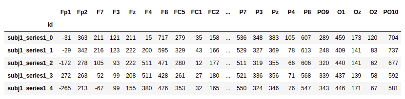
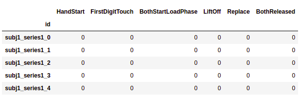
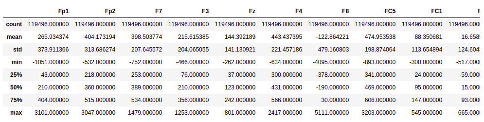
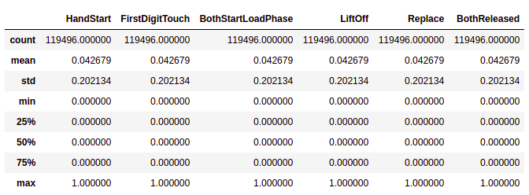
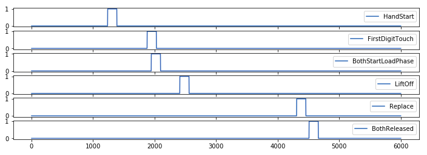
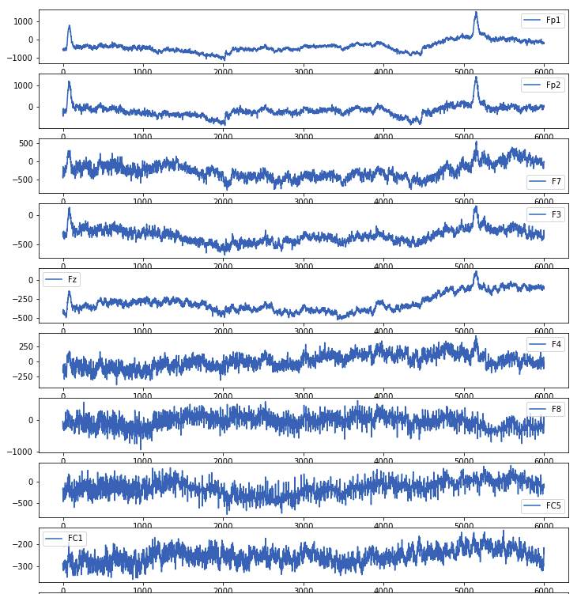
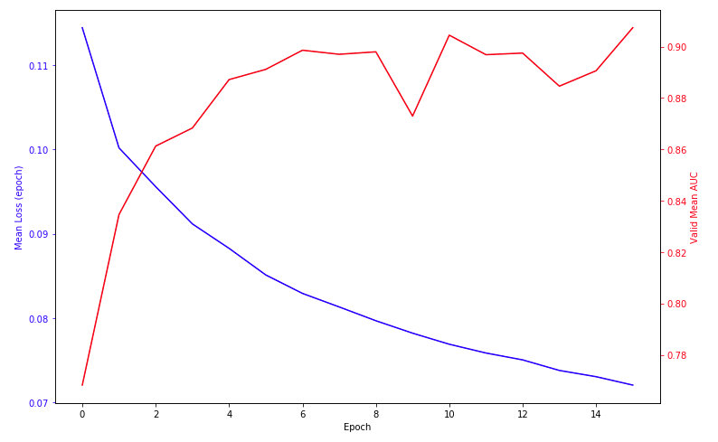
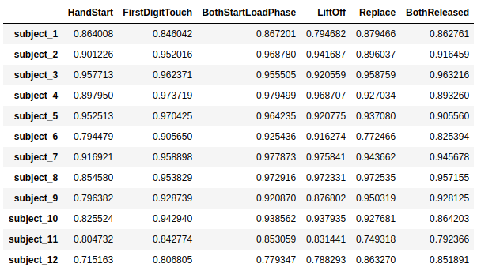
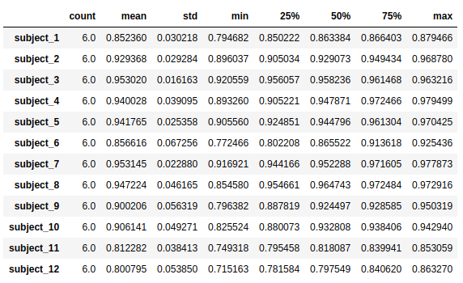
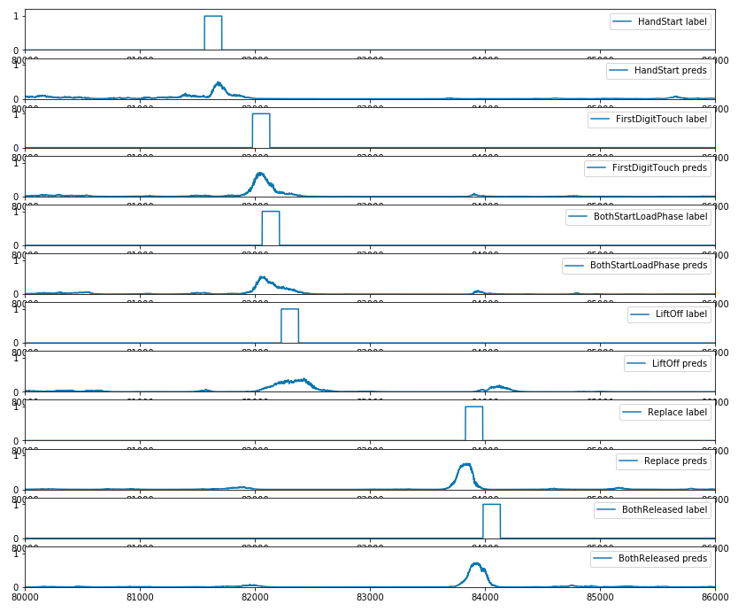

# Project Definition
<!-- _(approx. 2-3 pages)_ -->

Data and guidelines for this project had been taken from a Kaggle competition on EEG recordings [@kaggleEEGgrasp]. The project's solution can be found in its GitHub repository:


[`https://github.com/arthurcgusmao/eeg-grasp-and-lift`](https://github.com/arthurcgusmao/eeg-grasp-and-lift)


## Domain Background
<!-- _(approx. 1-2 paragraphs)_ -->

<!-- In this section, provide brief details on the background information of the domain from which the project is proposed. Historical information relevant to the project should be included. It should be clear how or why a problem in the domain can or should be solved. Related academic research should be appropriately cited in this section, including why that research is relevant. Additionally, a discussion of your personal motivation for investigating a particular problem in the domain is encouraged but not required. -->

Brain-machine interfaces (BMIs) use signals recorded from the brain to drive external hardware. One type of such signals are EEG (electroencephalography). An interesting property of EEG is that it is typically noninvasive: electrodes are placed along the scalp, in constrast with ECoG (electrocorticography), where electrodes are placed directly on the exposed surface of the brain. In clinical contexts, EEG refers to recordings of the brain's spontaneous electrical activity over a period of time, where multiple electrodes are placed on different positions on the scalp.

Currently, the relationship between brain activity and EEG signals is poorly understood. It is believed that a better understanding of these signals, possibly with the help of smart machine learning algorithms, can be used to build smarter BMIs. Better equipments, in turn, can aid patients who have gone through amputation or neurological disabilities to move through the world with greater autonomy.

The goal of classifying EEG signals in classes of specific movements or brain activity with the intention of driving external hardware, using machine learning techniques, is not new. @millan_noninvasive_2004 showed "that two human subjects successfully moved a robot between several rooms by mental control only, using an EEG-based brain-machine interface that recognized three mental states." With a performance ration of 74%, mental control was compared to manual control, for the same task. @morash2008classifying were able to classify EEG signals preceding right hand, left hand, tongue, and right foot movements and motor imageries, where accuracy varied significantly between subjects. @wang2009predicting used EEG signals recorded specifically from the posterior parietal cortex to achieve an average accuracy of 80.25% on four subjects in binary single-trial classification to distinguish different movement directions (left versus right). Similarly, @alomari2013automated was able classify EEG signals associated with left and right hand movements. The authors firstly focused on finding a feature extraction that would best enable the differentiation between left and right movements. Then, they applied two machine learning algorithms to the dataset composed of extracted features: support vector machines and neural networks. The former technique achieved the best accuracy: 97.1% in constrast to 89.8 of the neural network model.
Finally, we note that the main focus of this project is to have the student go through the entire process of applying machine learning techniques seen throughout the Nanodegree course, rather than performing en extensive literature review as one should when doing traditional research. This is the reason why we kept literature review short and limited in this paragraph.

## Problem Statement
<!-- _(approx. 1 paragraph)_ -->

<!-- In this section, clearly describe the problem that is to be solved. The problem described should be well defined and should have at least one relevant potential solution. Additionally, describe the problem thoroughly such that it is clear that the problem is quantifiable (the problem can be expressed in mathematical or logical terms) , measurable (the problem can be measured by some metric and clearly observed), and replicable (the problem can be reproduced and occurs more than once). -->

The problem this project addresses is how to build a model or algorithm that is able to capture the relationship between brain activity and EEG signals in such a way that building effective BMIs for disabled patients can become feasible. Useful BMIs should have the property that it can predict with high accuracy what the patient is thinking (in our context, what movement he is trying to make). The range of allowed movements should be fixed so that a classifier can map the input (EEG signals up to the current time) to a set of allowed movements, possibly assigning a probability for each class of movement.


## Datasets and Inputs
<!-- _(approx. 2-3 paragraphs)_

In this section, the dataset(s) and/or input(s) being considered for the project should be thoroughly described, such as how they relate to the problem and why they should be used. Information such as how the dataset or input is (was) obtained, and the characteristics of the dataset or input, should be included with relevant references and citations as necessary It should be clear how the dataset(s) or input(s) will be used in the project and whether their use is appropriate given the context of the problem. -->

The data contains EEG recordings of subjects performing graps-and-lift (GAL) trials. An instance trial can be seen in the following video:

[`https://www.youtube.com/watch?v=y3_Izuop2gY`](https://www.youtube.com/watch?v=y3_Izuop2gY)

A scene from the video is shown in Figure @fig:movement_scene.

{#fig:movement_scene}

There are 12 subjects in total, 10 series of trials for each subject, and approximately 30 trials within each series. The number of trials varies for each series.

Each GAL should correspond to one of 6 events:

1. HandStart
2. FirstDigitTouch
3. BothStartLoadPhase
4. LiftOff
5. Replace
6. BothReleased

These events always occur in the same order. In the training set, there are two files for each subject + series combination:

- the `*_data.csv` files contain the raw 32 channels EEG data (sampling rate 500Hz)
- the `*_events.csv` files contains the ground truth frame-wise labels for all events

The events files for the test set are not provided and must be predicted. Each timeframe is given a unique id column according to the subject, series, and frame to which it belongs. The six label columns are either zero or one, depending on whether the corresponding event has occurred within ±150ms (±75frames). A perfect submission will predict a probability of one for this entire window.

### Important Note

When predicting, data from the future may NOT be used! In other words, when predicting labels for id `subj1_series9_11`, any frame after 11 of series 9 from subject 1 may not be incorporated. In the real application for of a detection algorithm like this, future data doesn't exist.

Data leakage must not be included. For example, one may not center the signals for `subj1_series9_11` based on the mean of all frames for `subj1_series9`. Instead, one must use the mean based on frame 0 to 10.

Data from other subjects and series outside of the series for which you are predicting may be used for training. For example, one can use all of `subj2_series6` when predicting `subj1_series5`.

The columns in the data files are labeled according to their associated electrode channels. The spatial relationship between the electrode locations (shown in Figure @fig:eeg_electrodes) may be considered for the analysis. A detailed account of the data can be found in @luciw2014multi.

{#fig:eeg_electrodes}


## Solution Statement
<!-- _(approx. 1 paragraph)_

In this section, clearly describe a solution to the problem. The solution should be applicable to the project domain and appropriate for the dataset(s) or input(s) given. Additionally, describe the solution thoroughly such that it is clear that the solution is quantifiable (the solution can be expressed in mathematical or logical terms) , measurable (the solution can be measured by some metric and clearly observed), and replicable (the solution can be reproduced and occurs more than once). -->

Any supervised machine learning algorithm can be used to tackle this problem. The kind of model to be adopted, however, may drastically impact in the final results (the test accuracy). Due to the high dimensionality of the data, the nonlinearities that EEG signals may present, the spatial relationship and the sequential nature of the problem, we intend to use deep neural networks as the model of choice.

More specifically, architectures such as the ones used in recurrent neural networks and convolutional neural networks work well in this scenario. The approximately 3600 trials should is a sufficient number of examples to train a neural network with reasonable complexity, which makes us confident that we can achieve good results using the aforementioned models.


## Evaluation Metrics
<!-- _(approx. 1-2 paragraphs)_

In this section, propose at least one evaluation metric that can be used to quantify the performance of both the benchmark model and the solution model. The evaluation metric(s) you propose should be appropriate given the context of the data, the problem statement, and the intended solution. Describe how the evaluation metric(s) are derived and provide an example of their mathematical representations (if applicable). Complex evaluation metrics should be clearly defined and quantifiable (can be expressed in mathematical or logical terms). -->

The metric this project will focus on is the mean column-wise AUC, that is, the mean of the individual areas under the ROC curve for each predicted column. The reason for this choice is that the mean column-wise AUC discourages the model from not being very discriminative. This is specially valuable when one class (one type of movement) occurs for a very long period of time. If we were to use accuracy instead of AUC, the model could likely start to predict that in most instances (or most periods of time) one class of movement is the most likely to occur, not really discriminating between the possible movements the person is making. Further, all models in the Kaggle competition were already evaluated under this metric, making it easy to compare the model's performance.


<!-- ------------------------------------------ -->

# Analysis

All code used to arrive at the results presented in this section is available on the `Data Analysis.ipynb` jupyter notebook, at the project's repository.

## Data Exploration

We begin the data exploration by looking at the raw data. In Figures @fig:feats_instance and @fig:labels_instance, we print the features and the labels tables of a data series recorded for the first subject. From the prints we can confirm the shape of our data: we have 32 features whose signal values vary roughly around -500 and +600, and 6 binary labels which can take the values 1 or 0.

{#fig:feats_instance}

{#fig:labels_instance}


Following the exploration, we print basic statistics about the series in question, again for both features and labels, shown in Figures @fig:feats_stats and @fig:labels_stats. From the statistics, we have a description of the feature values and the labels for the first series. We can now better see the range of the feature values for this series. The median is close to the distribution's mean, which shows that the distribution is not much skewed, for all features. Regarding the labels, we see that the subject is considered to be performing a movement around 4.27% of the time. This label imbalance confirms the importance of using a metric such as the area under the ROC; otherwise, one could achieve very high accuracy metrics by simply predicting all labels as zero.

{#fig:feats_stats}

{#fig:labels_stats}


## Exploratory Visualization

The goal with our exploratory visualization is to visualize how the features and labels evolve over time during one repetition of the grasp and lift movement. In order to that, we begin by looking at the average and total series length:

```text
Average series length: 187351.604167
Sum of all series length: 17985754
```

So we have an average of 187352 frames in each series. Since there are on average 30 trials in each series (according to metadata), the duration of the complete trial (i.e., the completion of each of the six movements) should be roughly 6000 frames. Now that we have this estimate, we can plot how each label evolve over time for one repetition of the grasp-and-lift movement (Figure @fig:one_rep_labels).

{#fig:one_rep_labels}


Experimenting with plots such as the one in Figure @fig:one_rep_labels, for different series, we can see that there is some overlapping of labels, specially for the "FirstDigitTouch", "BothStartLoadPhase" and "LiftOff" labels. Therefore, we must NOT apply a softmax function at our outputs, but a sigmoid instead. In other words, it is not only a *multi-class classification* problem, but a *multi-label classification* one.

Next, we plot how the features evolve over time for the corresponding last labels plot, shown in Figure @fig:one_rep_features. Looking at the plot we can see that this is indeed a complex problem, such that a human being is not able to easily identify how to predict the occurrence of a specific movement. This makes the scenario where being able to apply machine learning techniques becomes especially valuable.

{#fig:one_rep_features}


## Algorithms and Techniques

Considering the complexity of the signals and its temporal (sequential) nature, the algorithm that we chose to tackle this problem are neural networks. The advantages of using neural networks is that we can perform minimal data preprocessing techniques and let the algorithm take care of the feature extraction procedure that one should otherwise perform.

### A simple overview of neural networks

Neural networks are a class of *machine learning* models, inspired by how biological neural networks work, that consist of several artificial neurons arranged in specific architectures. Each artificial neuron loosely models a biological neuron in the sense that it is connected to several other neurons and yields an output as a function of its inputs and parameters. By changing either a NN's architecture or its parameters, one is able to modify how the network respond to different inputs, being able to develop networks that better model phenomenons in the real world. Usually, one makes use of optimization algorithms to improve the parameters (also known as weights) of a NN with respect to a set of observations (data points) from the real world, which we call *learning* the weights of a NN.

Learning requires that we find a way to optimize the model weights so that the output gets as close as possible to the ground truth values. In order to do so, we define a *loss (or error) function*, a function that penalizes outputs that differ from the correct values by assigning a higher value to them, and work towards minimizing the results of this loss function by updating the neural network's weights. The most efficient manner of doing so is to have a loss function that is differentiable so that we can employ *gradient descent*, an optimization method to (locally) minimize a function. Gradient descent works by calculating the gradient of a function (the gradient points in the direction of the greatest increase rate of the function) at a given point and changing the function's parameters (in our case, the neural network's weights) in the opposite direction.

When we have a network with more than one hidden layer, however, we can only directly apply gradient descent to the last layer. In order to apply it to the other layers, we must first assign a portion of the error to each neuron of the layer, and we do so through *backpropagation*.
Backpropagation is a short expression for "backward propagation of errors". Intuitively, it propagates the output errors of the network backwards, associating a relative value of the error for each unit of the hidden layer. This relative value is then used to update the weights of that unit. The process is repeated for each hidden layer, and we have a solution to perform learning for the entire network.

### Project design

We are going to test different NN architecture types. We will start with feedforward neural networks before moving into more elaborate architectures. After assessing the initial model's performance, we are going to experiment with convolutional layers. They will be designed to take advantage of the temporal characteristic of the input variables. Of course, we could employ *recursive neural networks* (RNNs) to model the same characteristic, but recently convolutional networks (ConvNets) have been shown to achieve state-of-the-art results and be comparable to RNNs [@borovykh2017conditional]. In addition, ConvNets can be faster [@perry_conv_medium] and therefore will allow us to have a feedback on model performance in less time, accelerating the development cycle.

After the architecture is fixed, we are going to tune the hyper-parameters. At this stage, we are going to adopt the following strategy:

- Start with some acceptable values for all hyper-parameters.
- Tune the mini-batch size first. The values considered for the mini-batch size usually vary between 32 and 256.
- Use TensorFlow's [AdamOptimizer](https://www.tensorflow.org/api_docs/python/tf/train/AdamOptimizer), an optimization method with an adaptative learning rate, with the default initial hyper-parameters. We may experiment with different learning rates; however, the default parameters usually work well in this implementation.
- For the number of epochs, early stopping may be used. Early stopping is when we stop the learning process when the validation error starts increasing, given some tolerance measure.
- The starting number of hidden layers in the model will depend on the architecture adopted. It has been observed that up to 3 hidden layers tend to work very good in fully connected networks, while more than that does not help much. When it comes to ConvNets tough, the more hidden layers there are the better the algorithm tends to perform in general, at least in image classification problems. When dealing with convolutions for time series classification this may not hold, and it is something we are going to experiment with.
- The gap between the validation and training error will guide us on the number of hidden units in each layer (and for the number of hidden layers as well). The adoption of techniques such as dropout or L2 regularization will also influence on that. A good rule for the number of hidden units is to increase them until the validation error stops increasing.
- More guidelines on how to tune the hyperparameters can also be found in the book "Neural Networks and Deep Learning" [@neuralnetworksdeeplearningbook].

If we find that the number of examples could be a factor that is limiting the algorithm from capturing the nature of the problem, we can go for a smaller model and maybe apply dimensionality reduction on the data. Algorithms such as Principal Component Analysis (PCA) can then be used. At first, however, we will not want to perform this sort of strategy because we do not know if it will be necessary and if it can somehow diminish the capability of the model to learn a useful representation. Further, it has been shown that ad-hoc feature extraction can be redundant for physiology-based modeling [@martinez_learning_2013]. We hope that the convolutional layers will be capable of dealing well with data without the use of these strategies.

If, after all different architectures tried and hyperparameteres extensively tuned, we are still unable of achieving a good performance with neural networks (at least similar to the baselines presented above), other algorithms will be tried. However, as we saw in the competition's webpage, there are good results with neural networks, so this should not be the case.


## Benchmark

Hundreds of models can be found at [the Kaggle competition webpage](https://www.kaggle.com/c/grasp-and-lift-eeg-detection/leaderboard). We can see that the best results are around 0.98 for the mean columnwise area under receiver operating characteristic curve.

Since in this project we intend to use deep neural networks, it will be interesting to compare the results both with similar and different models. From the competition's webpage, we see models that use neural networks, such as [a CNN model](https://www.kaggle.com/anlthms/convnet-0-89) and [a simpler one](https://www.kaggle.com/bitsofbits/naive-nnet), for instance, and models that use other methods, such as [this model based on SVMs](https://www.kaggle.com/karma86/rf-lda-lr-v2-1) and [this model based on a mixture of classifiers](https://www.kaggle.com/mostafafr/rf-lda-lr-v2-1). The best reported result for a neural network was 0.934 AUC ([code link](https://www.kaggle.com/smilesun/convnet-auc-0-934)), so this is a value that we keep as benchmark.

<!-- ------------------------------------------ -->

# Methodology

## Data Preprocessing

From the data exploration, we see that the data is somewhat zero centered and normalized, due to the nature of the signals. Nevertheless, performing data standardization can help the model to learn faster. Data standardization centers the data around zero and normalizes it so that is has a standard deviation of one. These changes are able to improve learning for the following reasons:

- **Zero centering**: when inputs to a neural network layer are predominantly positive or negative (or, in the extreme, when they are all positive or all negative), we hurt the optimization process because we constrain weight updates to be taken in restricted directions. Zero centering the data removes this issue, thus helping convergence.
- **Normalizing**: when the range of values vary across features, features with greater range will have more influence on the gradient calculation, and, consequently, on weight update. Normalizing the data avoids this by making all features be in the same range, thus making each feature contribute equally to weight update.

No other data preprocessing technique was applied in addition to data standardization.

## Implementation

All the models that we experimented with were built using TensorFlow, on Python 2.7. The Numpy and Pandas libraries to help with matrix/tensor operations and data reading. For auxiliary functions related to machine learning data preprocessing and evaluation, we used Sci-Kit Learn.

TensorFlow already possesses all necessary functions to implement very refined neural networks. We created a `Model` class (defined in the `./model.py`, found in the project's repository)  that takes as input a model definition (i.e., a TensorFlow graph definition, which defines the neural network architecture), instantiates additional graph operations needed for training and performs learning and validation. We used the [sigmoid cross-entropy](https://www.tensorflow.org/api_docs/python/tf/nn/sigmoid_cross_entropy_with_logits) function as loss function, meaning that, for this loss, a perfect classification would yield a value close to zero. We used TensorFlow's implementation of the [AdamOptimizer](https://www.tensorflow.org/api_docs/python/tf/train/AdamOptimizer) as the optimizer to minimize this loss function.

The neural network definitions, passed to the model class described above, were a simple feedforward model, used only in the beginning of the experiments, and different convolutional neural networks, the final model. All of the definition are in the [`model_defs.py`](./model_defs.py) file present in the project's repository. All layers of the neural network were implemented using TensorFlow's functions: dense and convolutional layers, pooling and batch_normalization are among the operations that we used. For each kind of model definition, we had to implement a batch generator, that is, a function that was able to generate mini-batches, to train or validate the neural network, that was fast and memory efficient. These functions are also defined in the [`model_defs.py`](./model_defs.py) file, and they are also passed to the [`Model`](./model.py) class when instantiating the neural network.

In order to build the validation set, we picked one series from each subject of the entire data. The rest of the data was used in the training set.

One caveat when generating batches for ConvNets in temporal data that we had to deal with is that we are not able to fully feed the neural network with inputs for frames ordered lower than the window size of the first convolutional layer. In order to overcome this issue, one could define a default value for inexistent data points (that is, frames before the first series frame). However, for our purposes, we decided to simply modify the batch generation function to do not generate data points for frames ordered lower than the current window size. Since we have a lot of training data, losing a few points at the beginning of each series is not significant. In addition, the first data points tend to not have any active label, which makes them even less useful for improving the model. In any case, modifying the batch generating function to comply with the first option is straightforward.

## Refinement

The initial model we experimented with was a very simple feedforward neural network with two hidden layers. The goal with the first experiments was to check whether the code was correctly written and if we were able to learn anything at all with the neural network, while still being able to do that on a simple model and therefore not have to wait a long time between training and validation. In this initial tests, an interesting results we found was that using standardization improved the mean ROC AUC from around 57% to 67%.

Another initial test consisted of evaluating a validation series from a specific subject using a model fit with only data from the same subject versus a model fit with all data. Initially we thought that fitting one model per subject could yield better results, but it was not the case.

After verifying that the model was actually learning and that the implementation was correct, we began tuning the hyperparameters, for the convolutional networks, as described in past sections. We found that feeding the model with 4096 series was an optimal batch size, regarding both learning time and minimizing the training loss. After fixing the batch size, we experimented with the learning rate, and initially we found that it was not influencing on the results much.

The initial architecture for our convolutional network was based on [our benchmark model](https://www.kaggle.com/smilesun/convnet-auc-0-934) from the Kaggle's competition. With the same architecture implementation, we were able to achieve a validation mean AUC of 0.864, which we consider as a good result. That model has the following structure: one convolutional layer with 64 filters (kernel size of 3 and stride of 1), a dropout layer, and a fully connected layer with 128 units, before that last fully connected layer with 6 outputs.

However, we decided to experiment with different architectures and explore the usage of more layers in order to exploit the hierarchical representations that deeper networks are able to achieve. These experiments led us to the final model, which is described in more detail in the next section.


<!-- ------------------------------------------ -->

# Results

## Model Evaluation and Validation

As previously stated, we experimented with different network architectures in order to make use of the hierarchical representations that deep neural networks can achieve. In addition to that, a motivation for experimenting with different networks was that we wanted to decrease the number of parameters of the network, to make the model less complex and save learning time.

We tested different architectures, and the final solution is a convolutional neural network with has two convolutional layers (kernel size of 3 and stride of 2) of 32 and 16 filters, respectively, a max-pooling layer, and two fully connected layers of 256 and 32 neurons each before the final layer with 6 units (outputs). With the new architecture, we were able to achieve greater mean AUCs than we could with the previous architecture.

In Figure @fig:learning_curve, we plot the learning curve for the final model, with its validation mean AUC and training mean loss for each epoch.
The final model was trained for 16 epochs which took a total of 14.3 hours using a Nvidia GTX 1080Ti GPU. This learning time also includes the time alloted to calculating the mean AUC in the validation set at the end of each epoch.

{#fig:learning_curve}

In order to evaluate the model's robustness, we analyze the AUC in the validation set separately for each label and for each subject. The results are shown in Figure @fig:separate_AUC, where we can see that, in the worst case, the model achieved an AUC score of 0.715163 (for the label HandStart and the 12th subject). This means that, even in the worst case, the most is still able to identify in a relatively high percentage of the time moments when the user performed a movement.

In order to get a bigger picture, we also print overall statistics for the AUC (i.e., taking into account the AUC for each label and for each subject):
<!-- To get a bigger picture, we also plot statistics for the partial AUC, shown in Figures @fig:separate_AUC_stats_labels and @fig:separate_AUC_stats_subjects, for labels and subjects, respectively. From these results, we are able to see that the bigger standard deviation for the AUC is of 7.26% (label HandStart) and the worst mean value is 80.08% (last subject). -->

```text
count    72.000000
mean      0.907375
std       0.066030
min       0.715163
25%       0.854200
50%       0.920667
75%       0.954248
max       0.979499
dtype: float64
```

Looking at the overall statistics, we have a standard deviation of 6.6% of the mean AUC. We consider these results to be robust, especially when taking into account the limited number of training epochs.

{#fig:separate_AUC}

<!-- {#fig:separate_AUC_stats_labels}

{#fig:separate_AUC_stats_subjects} -->


## Justification

The final validation mean AUC we achieved for the final model was 0.907375, better than the 0.863480 that we achieved with our implementation of the benchmark model. In addition, our final model has almost an order of magnitude less parameters than the benchmark, which makes it faster to train and less prone to overfitting.

Notice that, although we increased the number of neurons on the dense layers, in comparison to the initial convolutional network, the total number of parameters in the network actually decreased (from more than 4 million parameters to less than 600 thousand). This happened because the layer with the higher number of parameters, responsible for more than 90% of all parameters in the network, is the first dense layer after the last convolutional layer. When we increase the stride of the convolutional layers to 2, we are able to achieve a significant decrease in the number of neurons after the max-pooling operation, considerably reducing the number of parameters that the most computationally expensive layer needs.


<!-- ------------------------------------------ -->

# Conclusion

## Free-Form Visualization

In this section we are going to plot the predictions of our model, in the form of the score output by the model after the sigmoid function, together with the ground truth labels, in order to evaluate visually and to have an intuition of how our model performs. The plot shown in Figure @fig:predictions corresponds to the predictions of a validation series taken from the fourth subject:

{#fig:predictions}

Although, at a first glance, one may have the impression that the model is not performing well enough, having a holistic understanding of the complexity of the problem helps us argue that the model achieved its goal. Since the predictions corresponds to a score between 0 and 1 that can be understood as a probability, it is clear in the plot that the model is definitely being able to assign a higher probability to moments close to the movement execution, and very low probabilities to moments further away from the execution. In other words, this means that our model is capable of separating the moments when the user performs a movement (assigning higher scores for them) from the moments when he is not performing it (assigning lower scores for them). This explains why our model achieved such a high AUC score. Thus, in practice, we are able to successfully use the final model to predict when a user is performing any of the six movements in question given that data is taken from a similar distribution.

## Reflection

The entire process used to arrive at the final solution consisted of three main parts: data analysis, model choice, and fine tuning. In the initial, data analysis phase, we explored the data in order to better understand it and to check whether its metadata was consistent with the actual data. We built data visualizations in the form of tables and curves, which helped to get more intuition on the challenge we were facing. Next, we used our understanding of the data to guide the model choice, which also involved research on state-of-the-art solutions to treat temporal (or sequential) problems. After we had a model of choice (convolutional neural networks), we defined a benchmark model to start from and worked towards improving the model with different hyperparameters settings and architecture changes, which composed the fine tuning part. An important technique used in the final part was to write down the different architectures that we were considering, which helped to understand how the different number of layers or the different number of neurons on each layer were affecting the final solution.

The application of the entire machine learning process to a real world problem such as this one allowed me to improve in several aspects as a future data scientist. Performing a small literature review on the subject contributed to enhance my knowledge about applying machine learning in EEG signals. In special, applying convolutional neural networks to temporal data was something that I did not even knew about. Going through different neural network architecture types in the different Kaggle kernels available allowed me to appreciate different code structures, frameworks, and architectures than the ones I was used to before. Performing the data exploration step and experimenting with different preprocessing techniques helped me to see the importance of standardizing data when using neural networks. The size of the data and the model complexity forced me to write code outside of a Jupyter notebook in order for it to be run from the command line, requiring more thought on code organization, which is very important in larger projects. Experimenting with different architecture types and tuning the hyperparameters several times contributed to develop a more intuitive understanding of how the hyperparameters affect one another, such as batch size and learning rate. Finally, having to delve deeper into machine learning concepts to write this report helped to solidify my understanding of machine learning in general and, especially, neural networks.


## Improvement

The current `conv_batch_generator` function, that generates batches for the convolutional networks, is taking too long to run. For a single validation series, it takes 14 seconds to run with 4096 batch size and 1024 window size, while running the validate function (which calls the generator as a subroutine) takes 30 seconds in total. Smaller batch sizes make the batch generation faster. However, they do not decrease the overall validation time, likely because in this case we parallelize less examples. This means that we can improve the validation time by making the batch generation faster for larger batch sizes. In this case, speed improvement is also expected to happen in training.

Regarding the model itself, applying batch normalization should be able to speed learning and provide a sort of regularization effect, helping to prevent overfitting, which is desired when training for more than 16 epochs.


# References
